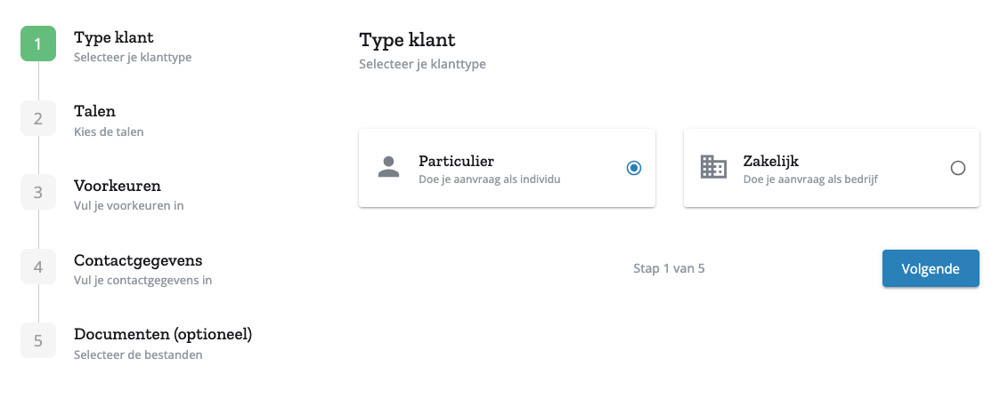
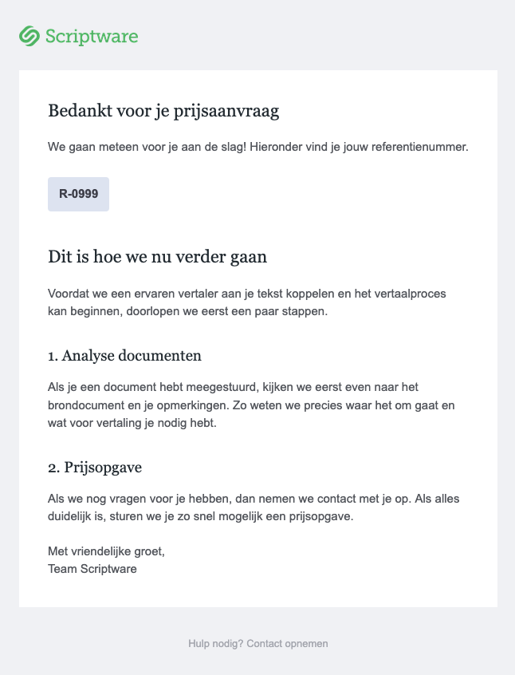

# Scriptware Offerte Aanvragen

Een website bezoeker van de Scriptware website moet een offerte kunnen aanvragen voor de vertaling van een document. De huidige website heb ik gebouwd in Webflow. Maar Webflow biedt niet de mogelijkheid om complexe html formulieren te maken. Bovendien moet er een connectie gelegd worden tussen Webflow en Plunet, het Project Management Systeem wat gebruikt wordt.

Voor deze uitgebreide offerte aanvraag heb ik een web applicatie ontwikkeld die draait op het volgende subdomein:

```
https://app.scriptwaretranslations.com/nl/wizard
```

## Technologie

Bij de ontwikkeling van de web applicatie heb ik gebruik gemaakt van de volgende technologie:

- **Node.js** - Serverless functions (backend API endpoints)
- **Netlify** - Hosting van de backend en frontend
- **React** - UI op de frontend
- **Vite** - React building tool
- **Plunet** - Project Management System
- **Amazon S3** - Bestand upload
- **MUI** - React material component library
- **Sendgrid** - Versturen van transactional e-mail via een RESTfull API

## Design

Voor het design heb ik gebruik gemaakt van de MUI library. Deze library biedt een groot aantal React form components ontworpen volgens Google's Material Design. Het design wat ook gebruikt wordt op Android. Ik heb hiervoor gekozen omdat dit sneller is dan zelf de componenten te bouwen en testen.

Het design bevat 3 responsive breakpoints. Er is een design voor schermen met veel horizontale ruimte:


Bij minder horizontale ruimte valt de rechterkolom weg:



En bij smalle schermen staan de stappen bovenaan:


## User experience

Om het overzicht voor de klant te bewaren is de aanvraag is verdeeld over 5 stappen. Het is altijd duidelijk zichtbaar in welke stap de klant zich bevindt en welke stappen afgerond zijn.

De browser back en forward knoppen zijn functioneel. De back knop gaat naar de vorige stap in het process, de forward knop naar de volgende stap.

Ook het path in het url verander als er een andere stap in het process bezocht wordt.

## Meertalig

De klanten van Scriptware zijn internationaal, dus de web applicatie moest ook meertalig zijn. Het formulier is beschikbaar in 2 talen, Nederlands en Engels. Het onderscheidt wordt gemaakt in het pad van de url.

```
NL https://app.scriptwaretranslations.com/nl/wizard
```

```
EN https://app.scriptwaretranslations.com/en/wizard
```

## Workflow

Op meerdere plekken op de Scriptware website staan knoppen die verwijzen naar het aanvragen van een offerte.

### 1. Het formulier invullen

Op de frontend zijn diverse stappen waar de klant zijn gegevens invult. Het toevoegen van Documenten is optioneel.

### 2. Nieuw Plunet Request aanmaken

Nieuwe offerte aanvragen worden in Plunet opgeslagen als een nieuw Request. De frontend maakt gebruik van het volgende backend API endpoint om een nieuw leeg request te maken:

```http
POST /api/request
```

Als response van de backend ontvangt de frontend het Request ID.

### 3. Bestanden uploaden

Voor het uploaden van bestanden maak ik gebruik van Amazon AWS S3. Met S3 is het mogelijk om direct vanaf de browser bestanden te uploaden naar de servers van Amazon. Hiervoor is een signed url nodig. Deze wordt gegenereerd door het volgende backend API endpoint:

```http
GET /api/signed-url
```

Als response ontvangt de frontend de signed url die het kan gebruiken voor het uploaden van de bestanden van de klant.

### 4. Plunet Request updaten

Aan de hand van het ontvangen Request ID maakt de frontend gebruik van het volgende backend API endpoint om het Plunet Request te updaten met de door de klant ingevulde gegevens:

```http
POST /api/update-request-background
```

Het backend API endpoint maakt gebruik van de Plunet SOAP API om alle gegevens in Plunet op te slaan.

Het backend API endpoint maakt gebruik van de Sendgrid RESTfull API om de klant een mail te sturen dat de offerte aanvraag succesvol is verlopen.



### 5. Succes redirect

Op de frontend vindt er een redirect plaats. De klant wordt doorverwezen naar de succes pagina.

